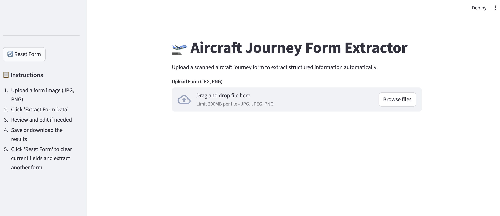
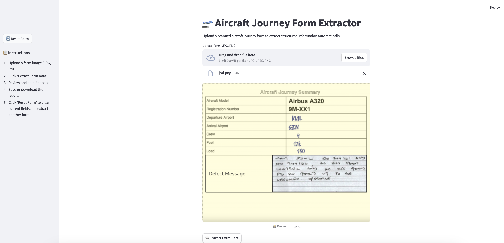
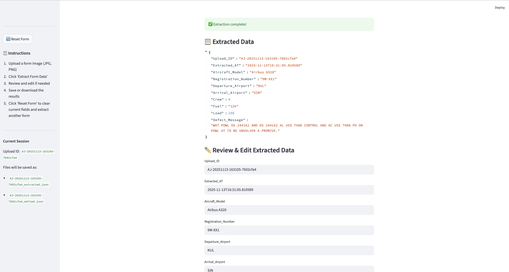

# Aircraft Journey Form Extractor

A lightweight backend service that extracts structured data from handwritten aircraft journey summary forms using OCR and intelligent field parsing.

## 🎯 Executive Summary

## 📋 Assumptions & Scope

## 🏗️ Approach & Design Decisions


## 📦 Installation & Setup

## 🔌 API Specification

```sequence
project/
├── src/
│   ├── core/
│   │   ├── __init__.py
│   │   ├── mistral_client.py
│   │   ├── validator.py
|   |   ├── ocr_evaluator.py
│   │   └── ocr_metrics.py
│   ├── api/
│   │   ├── __init__.py
│   │   ├── main.py
│   │   ├── router.py
│   │   ├── endpoint.py
│   │   └── request.py          
│   └── utils/
│       ├── __init__.py
│       ├── aws_utils.py
│       └── utils.py
├── notebooks/
│   └── demo_ocr.ipynb
├── tests/
│   ├── __init__.py
│   └── test_ocr.py
├── settings.py
└── requirements.txt
```
#### Logical Grouping:
- `api/schemas.py `- API request/response models
- `api/router.py`- API route definitions
- `api/endpoint.py` - API endpoint handlers
- `api/main.py` - FastAPI app initialization

#### Separation of Concerns:
- `api/` - Everything HTTP/API related
- `core/` - Business logic & domain
- `utils/` - Shared utilities

#### JSON Output
```JSON
{
  "extracted_data": {
    "Upload_ID": "AJ-20251114-232258-12138951",
    "Extracted_AT": "2025-11-14T23:22:58.781162",
    "Aircraft_Model": "Airbus A320",
    "Registration_Number": "9M-XX1",
    "Departure_Airport": "KUL",
    "Arrival_Airport": "SIN",
    "Crew": 4,
    "Fuel": "12k",
    "Load": 150,
    "Defect_Message": "WAT POWL DS 244161 AND DS 244162 AL USS THAN CONTROL AND AC USS THAN PD ON POWL UT TO BE UNVOLVER A PROMIVE.",
    "version": "extracted",
    "saved_at": "2025-11-14T23:23:02.948718",
    "file_name": "jml.png"
  },
  "data_validation": {
    "Aircraft_Model": {
      "value": "Airbus A320",
      "confidence": 1.0,
      "validated": true,
      "validation_method": "known_model",
      "reason": null
    }
  ...
  },
  "data_assessment": {...
  },
  "metadata": {
    "overall_confidence": 0.91125,
    "fields_extracted": 8,
    "fields_validated": 7,
    "requires_human_review": true,
    "flagged_fields": [
      "Defect_Message"
    ],
    "total_fields": 8
  },
  "raw_ocr_markdown": "# Aircraft Journey Summary\n\n|  Aircraft Model | Airbus A320  |\n| --- | --- |\n|  Registration Number | 9M-XX1  |\n|  Departure Airport | KML  |\n|  Arrival Airport | SIN  |\n|  Crew | 4  |\n|  Fuel | 12k  |\n|  Load | 150  |\n|  Defect Message | WAT POWL DS 244161 AND DS 244162 AL USS THAN CONTROL AND AC USS THAN PD ON POWL UT TO BE UNVOLVER A PROMIVE.  |",
  "schema_version": "1.0"
}

```

Stremlit landing page: 


Once user upload form:


Extraction and data saving:



